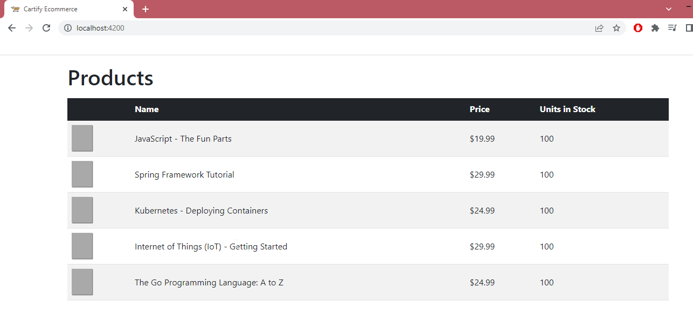
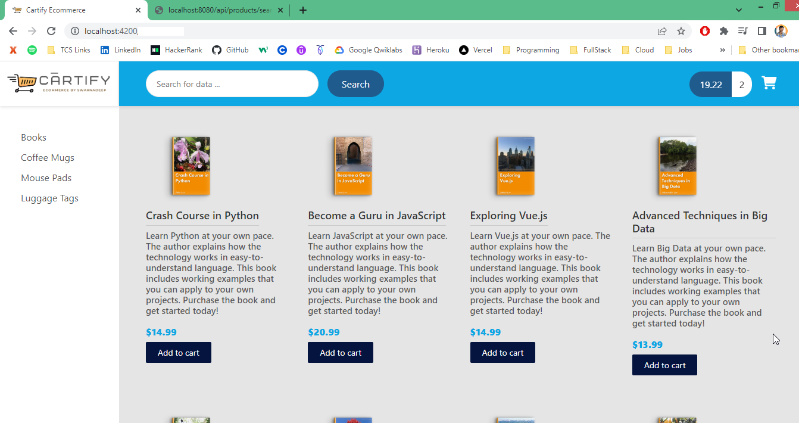
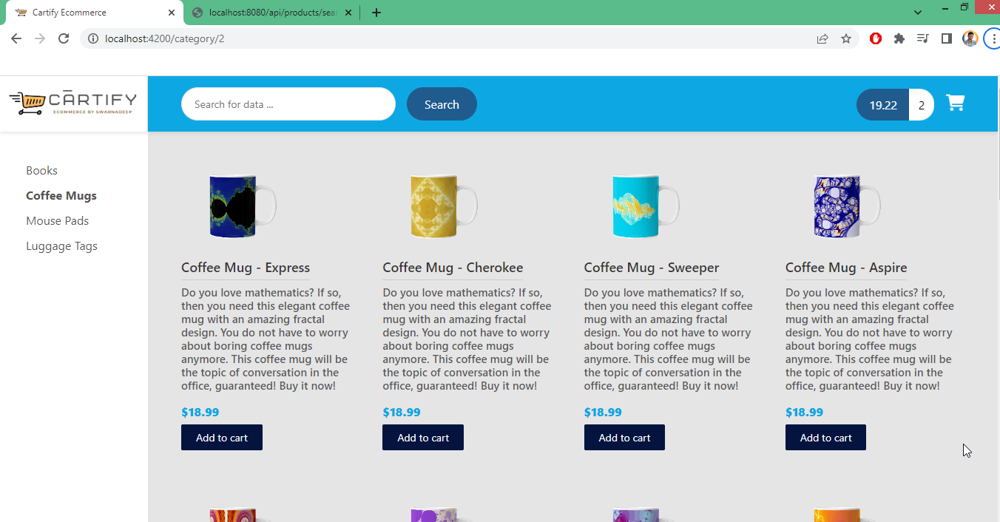

# Cartify Ecommerce Guide


## Introduction


**Design Requirements - Backend**

- Show a list of products 
- Add products to shopping cart (CRUD)
- Shopping cart check out 
- User login/logout security 
- Track previous orders for logged in users


### Release Plan

- **Release 1.0**
  - **Show a list of products**

- **Release 2.0**
  - **Add products to shopping cart (CRUD)**
  - **Shopping cart check out**

- **Release 3.0**
  - **User login/logout security**
  - **Track previous orders for logged in users**


**Release 2.0 - Plan**

- Online Shop Template Integration

- Search for products by category

- Search for products by text box

- Master / detail view of products

- Pagination support for products

- Add products to shopping cart (CRUD)

- Shopping cart check out


## **Backend 1.0**

**Development Process Backend - Release 1.0**

1. Set up the database tables 
2. Create a Spring Boot starter project (start.spring.io) with Dependencies : `web,data-rest,data-jpa,postgresql,lombok`
3. Develop the Entities: Product and ProductCategory 
4. Create REST APIs with Spring Data JPA Repositories and Spring Data REST
5. Add CrossOrigin support to Spring Boot app


### Database

We can connect postgres database from windows command line / powershell using below command 

```sh
cockroach sql --url "postgresql://swarnadeep:<<Password_here>>@free-tier12.aws-ap-south-1.cockroachlabs.cloud:26257/defaultdb?sslmode=verify-full&options=--cluster%3Dswarna-db-200"
```

**SELECT queries to check data** 

```sql
select * from "cartify_ecommerce".product_category pc ;
select * from "cartify_ecommerce".product p ;
```

**Insert Data in DB** 

```sql
INSERT INTO "cartify_ecommerce".product_category(id, category_name) VALUES (nextval('cartify_ecommerce.pc_seq'), 'BOOKS');

INSERT INTO "cartify_ecommerce".product (id, sku, name, description, image_url, active, units_in_stock, unit_price, category_id, date_created)
VALUES (nextval('cartify_ecommerce.product_seq'), 'BOOK-TECH-1000', 'JavaScript - The Fun Parts', 'Learn JavaScript',
'assets/images/products/placeholder.png' ,'1',100,19.99,1, NOW());

INSERT INTO "cartify_ecommerce".product (id, sku, name, description, image_url, active, units_in_stock, unit_price, category_id, date_created)
VALUES (nextval('cartify_ecommerce.product_seq'), 'BOOK-TECH-1001', 'Spring Framework Tutorial', 'Learn Spring',
'assets/images/products/placeholder.png' ,'1',100,29.99,1, NOW());

INSERT INTO "cartify_ecommerce".product (id, sku, name, description, image_url, active, units_in_stock, unit_price, category_id, date_created)
VALUES (nextval('cartify_ecommerce.product_seq'), 'BOOK-TECH-1002', 'Kubernetes - Deploying Containers', 'Learn Kubernetes',
'assets/images/products/placeholder.png' ,'1',100,24.99,1, NOW());

INSERT INTO "cartify_ecommerce".product (id, sku, name, description, image_url, active, units_in_stock, unit_price, category_id, date_created)
VALUES (nextval('cartify_ecommerce.product_seq'), 'BOOK-TECH-1003', 'Internet of Things (IoT) - Getting Started', 'Learn IoT',
'assets/images/products/placeholder.png' ,'1',100,29.99,1, NOW());

INSERT INTO "cartify_ecommerce".product (id, sku, name, description, image_url, active, units_in_stock, unit_price, category_id, date_created)
VALUES (nextval('cartify_ecommerce.product_seq'), 'BOOK-TECH-1004', 'The Go Programming Language: A to Z', 'Learn Go',
'assets/images/products/placeholder.png' ,'1',100,24.99,1, NOW());
```


***application.properties***

```properties
############### Spring REST ###############
spring.data.rest.base-path=/api

############### JPA config ###############
spring.jpa.hibernate.ddl-auto=update
spring.jpa.show-sql=true
# spring.jpa.defer-datasource-initialization=true
spring.sql.init.mode=always
#spring.datasource.initialization-mode=always #--> Or for Spring Boot before 2.5:

############### Connecting to Postgres Database ###############
spring.datasource.url=jdbc:postgresql://free-tier12.aws-ap-south-1.cockroachlabs.cloud:26257/swarna-db-200.defaultdb
spring.datasource.username=swarnadeep
spring.datasource.password=<<Password_here>>
spring.datasource.driver-class-name=org.postgresql.Driver
spring.jpa.properties.hibernate.dialect = org.hibernate.dialect.PostgreSQLDialect
```


### ProductCategory

Designed ProductCategory entity and Repository

***ProductCategory.java***

```java
package com.swarna.cartify.entity;
...
@Entity
@Data
@Table(name="product_category" , schema = "cartify_ecommerce")
public class ProductCategory {

    @Id
    @SequenceGenerator(name = "pc_seq",sequenceName = "pc_seq",allocationSize = 1, schema = "cartify_ecommerce")
    @GeneratedValue(strategy = GenerationType.SEQUENCE, generator = "pc_seq")
    @Column(name = "id")
    private long id;

    @Column(name = "category_name")
    private String categoryName;

    @OneToMany(cascade = CascadeType.ALL, mappedBy = "category")
    private Set<Product> products;
}
```

***ProductCategoryRepo.java***

```java
package com.swarna.cartify.repo;
import org.springframework.data.rest.core.annotation.RepositoryRestResource;

//RepositoryRestResource will change default endpoint, so that we can access data using '/api/product-category'
@RepositoryRestResource(collectionResourceRel = "productCategory", path = "product-category")
public interface ProductCategoryRepo extends JpaRepository<ProductCategory, Long> {
}
```


### Product

***Product.java***

```java
@Entity
@Data
@Table(name="product" , schema = "cartify_ecommerce")
public class Product {

    @Id
    @SequenceGenerator(name = "product_seq",sequenceName = "product_seq",allocationSize = 1, schema = "cartify_ecommerce")
    @GeneratedValue(strategy = GenerationType.SEQUENCE, generator = "product_seq")
    @Column(name = "id")
    private Long id;

    @ManyToOne
    @JoinColumn(name = "category_id", nullable = false)
    private ProductCategory category;

    @Column(name = "sku")
    private String sku;

    @Column(name = "name")
    private String name;

    @Column(name = "description")
    private String description;

    @Column(name = "unit_price")
    private BigDecimal unitPrice;

    @Column(name = "image_url")
    private String imageUrl;

    @Column(name = "active")
    private boolean active;

    @Column(name = "units_in_stock")
    private int unitsInStock;

    @Column(name = "date_created")
    @CreationTimestamp // Created timestamp will be updated automatically
    private Date dateCreated;

    @Column(name = "last_updated")
    @UpdateTimestamp // Last updated timestamp will be updated automatically
    private Date lastUpdated;
}
```

***ProductRepo.java***

```java
package com.swarna.cartify.repo;
...
public interface ProductRepo  extends JpaRepository<Product, Long>{
}
```


### Spring REST, CORS Config

Here we used `spring-boot-starter-data-rest` to avoid making Controller and let spring do that in background. By this, We can use all REST methods without creating Controller.

In ***application.properties***, we mentioned an endpoint, where all backend api calls will be added after that

```properties
spring.data.rest.base-path=/api
```


**Default Endpoints**

- By default, Spring Data REST will create endpoints based on entity type 
  - Simple pluralized form 
  - First character of Entity type is lowercase 
  - Then just adds an “s” to the entity 

**For example,** 

- if Repository will be : `public interface ProductRepo  extends JpaRepository<Product, Long>`
- Then Endpoint will be : `/products`
- *Spring Data REST will expose these endpoints for free!*

| HTTP Method | Endpoints      | CRUD Action                |
| ----------- | -------------- | -------------------------- |
| POST        | /products      | Create a new product       |
| GET         | /products      | Read a list of products    |
| GET         | /products/{id} | Read a single product      |
| PUT         | /products/{id} | Update an existing product |
| DELETE      | /products/{id} | Delete an existing product |


**Disable access for specific endpoints**

Now, I want the REST API as READ-ONLY , so I will **disable** access for POST , PUT and DELETE. So there is 2 options to do that.

- **Option 1**: Don't use Spring Data REST : Manually create our own @RestController and @GetMapping 
  - But we lose the Spring Data REST support for paging, sorting etc :-( 

- **Option 2**: Use Spring Data REST. I will prefer this. below is the config class for that.

MyDataRestConfig.java

```java
package com.swarna.cartify.config;
import com.swarna.cartify.entity.Product;
import com.swarna.cartify.entity.ProductCategory;
import org.springframework.context.annotation.Configuration;
import org.springframework.data.rest.core.config.RepositoryRestConfiguration;
import org.springframework.data.rest.webmvc.config.RepositoryRestConfigurer;
import org.springframework.http.HttpMethod;
import org.springframework.web.servlet.config.annotation.CorsRegistry;

@Configuration
public class MyDataRestConfig implements RepositoryRestConfigurer {

    @Override
    public void configureRepositoryRestConfiguration(RepositoryRestConfiguration config, CorsRegistry cors) {

        HttpMethod[] theUnsupportedActions = {HttpMethod.PUT, HttpMethod.POST, HttpMethod.DELETE, HttpMethod.PATCH};

        // disable HTTP methods for Product: PUT, POST, DELETE and PATCH
        config.getExposureConfiguration()
                .forDomainType(Product.class)
                .withItemExposure((metdata, httpMethods) -> httpMethods.disable(theUnsupportedActions))
                .withCollectionExposure((metdata, httpMethods) -> httpMethods.disable(theUnsupportedActions));

        // disable HTTP methods for ProductCategory: PUT, POST, DELETE and PATCH
        config.getExposureConfiguration()
                .forDomainType(ProductCategory.class)
                .withItemExposure((metdata, httpMethods) -> httpMethods.disable(theUnsupportedActions))
                .withCollectionExposure((metdata, httpMethods) -> httpMethods.disable(theUnsupportedActions));

        // Added for CORS allow origin
        cors.addMapping("/**").allowedOrigins("*")
            .allowedMethods("GET", "POST", "PUT", "DELETE", "OPTIONS")
            // .allowCredentials(false).maxAge(3600)
            ;
    }
}
```


**CorsConfig (Will not work for Spring Rest)**

***CorsConfig.java*** - To allow frontend domain fetch values from backend.

```java
// package com.swarna.cartify.config;
// ...
// @Configuration
// public class CorsConfig implements WebMvcConfigurer{

//     @Override
//     public void addCorsMappings(CorsRegistry registry) {
//         // WebMvcConfigurer.super.addCorsMappings(registry);
//         // registry.addMapping("/**").allowedOrigins(frontendURL)
//         registry.addMapping("/**").allowedOrigins("*")
//                 .allowedMethods("GET", "POST", "PUT", "DELETE", "OPTIONS");
//     }
// }
```


### Endpoints

```http
http://localhost:8080/api/products -- To see all products
http://localhost:8080/api/products/1 -- To check single product
http://localhost:8080/api/product-category -- To check all categories 
```


---

## **Frontend 1.0**

**Development Process Frontend - Release 1.0**

1. Create Angular project `ng new cartify-ui`
2. Create Angular component for product-list 
3. Develop TypeScript model class for Product `ng g class common/product`
4. Create Angular service to call REST APIs `ng g s services/productService`
5. Update Angular component to subscribe to data from Angular service 
6. Display the data in an HTML page


### Setup

**Create Angular project Setup**

```sh
$ ng new TodoList
$ cd Todolist
$ npm install bootstrap
$ npm install jquery
$ npm install @fortawesome/fontawesome-free
-- Downloaded versions: "bootstrap": "^4.4.1", "jquery": "^3.6.0",
```

Configure `angular.json` to activate bootstrap, Font-awesome and jquery

```json
"architect": {
    "build": {
        "builder": "@angular-devkit/build-angular:browser",
        "options": {
            "outputPath": "dist/course-api-ui",
            "index": "src/index.html",
            "main": "src/main.ts",
            "polyfills": "src/polyfills.ts",
            "tsConfig": "tsconfig.app.json",
            "assets": [
                "src/favicon.ico",
                "src/assets"
            ],
            "styles": [
              "src/styles.css",
              "./node_modules/bootstrap/dist/css/bootstrap.min.css",
              "./node_modules/@fortawesome/fontawesome-free/css/all.min.css"
            ],
            "scripts": [
              "./node_modules/jquery/dist/jquery.min.js",
              "./node_modules/bootstrap/dist/js/bootstrap.bundle.min.js"
            ]
        },
```

Included font-awesome icons in ***styles.css***

```css
@import url('https://maxcdn.bootstrapcdn.com/font-awesome/4.3.0/css/font-awesome.min.css');
```


 ***Product.ts* - Product model class**

```typescript
export class Product {
    sku: string;
    name: string;
    description: string;
    unitPrice: number;
    imageUrl: string;
    active: boolean;
    unitsInStock: number;
    dateCreated: Date;
    lastUpdate: Date;
}
```


### ProductService

 ***product.service.ts* - ProductService **

```typescript
...
export class ProductService {
  constructor(private http: HttpClient) {}

  public getAllProducts(): Observable<Product[]> {
    return this.http.get<GetResponse>(`${environment.apiServerUrl}/products`).pipe(
      map(response => response._embedded.products)) ;
  }
}

interface GetResponse {
  _embedded : {
    products : Product[];
  }
}
```


### product-list Component

***app.component.html***

```html
<div class="container">
    <h1 class="mt-3 mb-3">Products</h1>
    <app-product-list></app-product-list>
</div>
```


***product-list.component.html***

```html
<table class="table table-striped">
    <thead>
        <tr class="table-dark">
            <!-- <th scope="col">#</th> -->
            <th></th>
            <th scope="col">Name</th>
            <th scope="col">Price</th>
            <th scope="col">Units in Stock</th>
        </tr>
    </thead>
    <tbody>
        <tr *ngFor="let product of products">
            <!-- <th scope="row">{{product.}}</th> -->
            <td class="align-middle"></td>
            <td class="align-middle">{{product.name}}</td>
            <td class="align-middle">{{product.unitPrice | currency: 'USD'}}</td>
            <td class="align-middle">{{product.unitsInStock}}</td>
        </tr>
    </tbody>
</table>
```

***product-list.component.ts***

```typescript
export class ProductListComponent implements OnInit {
  products: Product[];

  constructor(private productService :ProductService) { }
  ngOnInit(): void {
    this.getAllProducts();
  }

  getAllProducts(){
    this.productService.getAllProducts().subscribe(
      data => { this.products = data })
  }
}
```


**Snapshot of Release 1.0**




## **Release 2.0**

- Online Shop Template Integration

- Search for products by category

- Search for products by text box

- Master / detail view of products

- Pagination support for products

- Add products to shopping cart (CRUD)

- Shopping cart check out


### Online Shop Template Integration

**Development Process**

1. Install Bootstrap and Fontawesome CSS styles locally using npm: `npm i bootstrap@4.4.1` and `npm i @fortawesome/fontawesome-free` . 

   Then add css and JS paths (Demonstrated Above Frontend 1.0 > Setup)

2. Add local custom CSS styles to Angular src/styles.css file

3. Integrate template files into Angular app

4. Add support for icons and logos

5. Enhance our application with product images


***app.component.html*** - writing only headlines here. For detail code, visit GitHub

```html
<!-- MENU SIDEBAR-->
...
<!-- HEADER DESKTOP-->
...
<!-- MAIN CONTENT of product list-->
<app-product-list></app-product-list>
...
<!-- FOOTER STARTS -->
```

***product-list.component.html***

```html
<div class="main-content">
    <div class="section-content section-content-p30">
        <div class="container-fluid">
            <div class="row">

                <!-- Loop over the products -->
                <div  *ngFor="let product of products" class="col-md-3">
                    <div class="product-box">
                        <a href="product-detail.html">
                            
                        </a>
                        <a href="product-detail.html">
                            <h1>{{ product.name }}</h1>
                        </a>
                        <h2>{{ product.description }} </h2>
                        <div class="price">{{ product.unitPrice | currency: 'USD' }}</div>
                        <a href="#" class="primary-btn">Add to cart</a>
                    </div>
                </div>
            </div>
        </div>
    </div>
</div>
```

> Spring REST gives 20 records by default , wheather there is any number of records or not
>
> We need to use **`${environment.apiServerUrl}/products?size=100`  to get all 100 products in frontend service ts file.**


Snapshot




### Find by Category

**Development Process**

1. Define routes and Configure Router based on our routes , Define the Router Outlet

4. Set up Router Links to pass category id param

5. Enhance ProductListComponent to read category id param

6. Modify Spring Boot app - REST Repository needs new method

7. Update Angular Service to call new URL on Spring Boot app


#### Backend- FindByCategory

***ProductRepo.java***

```java
package com.swarna.cartify.repo;
import org.springframework.data.domain.Page;
import org.springframework.data.domain.Pageable;
...
@RepositoryRestResource
public interface ProductRepo  extends JpaRepository<Product, Long>{

    //API will be => http://localhost:8080/api/products/search/findByCategoryId/?id=2
    Page<Product> findByCategoryId(@RequestParam("id") Long id, Pageable pageable);
}
```


#### Frontend- FindByCategory

**Adding Angular Routing first**

***app-routing.module.ts***

```typescript
import { NgModule } from '@angular/core';
import { RouterModule, Routes } from '@angular/router';
import { ProductListComponent } from './components/product-list/product-list.component';

const routes: Routes = [
  { path: 'category/:id', component: ProductListComponent },
  { path: 'category', component: ProductListComponent },
  { path: 'products', component: ProductListComponent },
  { path: '', redirectTo: '/products', pathMatch: 'full' },
  { path: '**', redirectTo: '/products', pathMatch: 'full' },
];

@NgModule({
  imports: [RouterModule.forRoot(routes)],
  exports: [RouterModule],
})
export class AppRoutingModule {}
```

***app.module.ts***

```typescript
import { AppRoutingModule } from './app-routing.module';
...
  imports: [...
    AppRoutingModule,
  ],
```

***app.component.html***

```html
...
            <nav class="navbar-sidebar">
                <ul class="list-unstyled navbar-list">
                    <li><a routerLink="/category/1" routerLinkActive="active-link">Books</a></li>
                    <li><a routerLink="/category/2" routerLinkActive="active-link">Coffee Mugs</a></li>
                    <li><a routerLink="/category/3" routerLinkActive="active-link">Mouse Pads</a></li>
                    <li><a routerLink="/category/4" routerLinkActive="active-link">Luggage Tags</a></li>
	...
        <!-- MAIN CONTENT-->
        <router-outlet></router-outlet>
        <!-- END MAIN CONTENT-->
```


***product.service.ts***

```typescript
...
public getProductsByCategory(currentCategoryId: number): Observable<Product[]> {
    return this.http.get<GetResponse>(`${environment.apiServerUrl}/products/search/findByCategoryId/?id=${currentCategoryId}`).pipe(
      map(response => response._embedded.products)
    ) ;
...
```

***product-list.component.ts*** - Fetching Parameter from URL using Activated route and calling service method

```typescript
export class ProductListComponent implements OnInit {
  products: Product[];
  currentCategoryId: number;

  constructor(private productService: ProductService, private route: ActivatedRoute ) {}

  ngOnInit(): void {
    this.route.paramMap.subscribe(() => {
      this.getAllProducts();
    });
  }

  getAllProducts() {

    //check if "id" parameter is available
    const hascategoryId: boolean = this.route.snapshot.paramMap.has('id');

    if(hascategoryId){
      // get the "id" parameter and converting to number using "+" symbol
      this.currentCategoryId = +this.route.snapshot.paramMap.get('id');
    } else{
      // if no category id available, default set to 1
      this.currentCategoryId = 1;
    }

    this.productService.getProductsByCategory(this.currentCategoryId).subscribe((data) => {
      this.products = data;
    });
  }
}
```

Snapshot




### FindBy Category Dynamically

**Development Process**

1. Modify Spring Boot app - Expose entity ids - Backend

2. Create a class: ProductCategory : `ng g class common/product-category`

3. Create new component for menu : `ng g c components/product-category-menu`

4. Enhance menu component to read data from product service

5. Update product service to call URL on Spring Boot app

6. In HTML, replace hard-coded links with menu component


#### Backend - FindByCategory Dynamic

**Goal :** 

```json
API : https://cartify-ecommerce-fullstack.herokuapp.com/api/product-category

From : There is no entity id at the productCategory level, so no easy access
{
  "_embedded" : {
    "productCategory" : [ {
      "categoryName" : "Books",
      "_links" : {
	 
To this : 
{
  "_embedded" : {
    "productCategory" : [ {
      "id" : 1,
      "categoryName" : "Books",
	  
```


***MyDataRestConfig.java***

```java
public class MyDataRestConfig implements RepositoryRestConfigurer {
    @Autowired
    private EntityManager entityManager;
...
        // call an internal helper method
        exposeIds(config);
    }

    private void exposeIds(RepositoryRestConfiguration config) {
        //expose entity ids
        // - get a list of all entity classes from the entity manager
        Set<EntityType<?>> entities = entityManager.getMetamodel().getEntities();

        // - create an array of the entity types
        List<Class> entityClasses = new ArrayList<>();

        // - get the entity types for the entities
        for (EntityType tempEntityType : entities) {
            entityClasses.add(tempEntityType.getJavaType());
        }

        // - expose the entity ids for the array of entity/domain types
        Class[] domainTypes = entityClasses.toArray(new Class[0]);
        config.exposeIdsFor(domainTypes);
    }
}
```


#### Frontend- FindByCategory Dynamic

***product-category.ts***

```typescript
export class ProductCategory {
  id: number;
  categoryName: string;
}
```


***product.service.ts***

```typescript
...
  getProductCategories(): Observable<ProductCategory[]> {
    return this.http
      .get<GetResponseProductCategory>(`${environment.apiServerUrl}/product-category`)
      .pipe(map((response) => response._embedded.productCategory));
  }
}
interface GetResponseProductCategory {
  _embedded: {
    productCategory: ProductCategory[];
  };
}
```


***app.component.html***

```html
<!--<div class="menu-sidebar-content js-scrollbar1"> ... </div> -->

Above DIV of sidebar will be replaced by below.
<app-product-category-menu></app-product-category-menu>
```


***product-category-menu.component.html***

```html
<!-- Dynamic Category name coming from database -->
<div class="menu-sidebar-content js-scrollbar1">
    <nav class="navbar-sidebar">
        <ul class="list-unstyled navbar-list">
            <!-- <li>
                <a routerLink="/category/1" routerLinkActive="active-link">Books</a>
            </li> -->
            <li *ngFor="let tempProductCategory of productCategories">
                <a routerLink="/category/{{ tempProductCategory.id }}" routerLinkActive="active-link">
                    {{ tempProductCategory.categoryName }}
                </a>
            </li>
        </ul>
    </nav>
</div>
```

***product-category-menu.component.html***

```typescript
export class ProductCategoryMenuComponent implements OnInit {
  productCategories: ProductCategory[];
  constructor(private productService: ProductService) {}
  ngOnInit() {
    this.listProductCategories();
  }

  listProductCategories() {
    this.productService.getProductCategories().subscribe((data) => {
      console.log('Product Categories=' + JSON.stringify(data));
      this.productCategories = data; });
  }
}
```


### Search Product by Keyword

**Development Process**

1. Modify Spring Boot app - Add a new search method

2. Create new component for search

3. Add new Angular route for searching

4. Update SearchComponent to send data to search route

5. Enhance ProductListComponent to search for products with ProductService

6. Update ProductService to call URL on Spring Boot app


***ProductRepo.java*** -  Backend - Find products based on name

```java
//API will be => http://localhost:8080/api/products/search/findByNameContainingIgnoreCase?name=Pyth
Page<Product> findByNameContainingIgnoreCase(@RequestParam("name") String name, Pageable pageable);
```


#### Frontend- Search ProductBy Keyword

***product.service.ts***

```typescript
searchProducts(keyword: string): Observable<Product[]> {
    const searchUrl = `${environment.apiServerUrl}/products/search/findByNameContainingIgnoreCase?name=${keyword}`;
    return this.getProduct(searchUrl);
  }

private getProduct(searchUrl: string): Observable<Product[]> {
    return this.http
      .get<GetResponseProducts>(searchUrl)
      .pipe(map((response) => response._embedded.products));
}
```

***app-routing.module.ts***

```typescript
{ path: 'search/:keyword', component: ProductListComponent },
```

***app-component.html*** - Sepeated search form from the header into a seperate component

```html
<!-- Search Form header -->
<app-search></app-search>
```


***search.component.html*** - Sepeated search form from the header into a seperate component

```html
<div class="form-header">
    <input #myInput type="text" placeholder="Search for products ..." class="au-input au-input-xl"
        (keyup.enter)="doSearch(myInput.value)" />
    <button (click)="doSearch(myInput.value)" class="au-btn-submit">
        Search
    </button>
</div>
```

***search.component.ts*** - taking value and navigating to Product list component

```typescript
export class SearchComponent implements OnInit {
  constructor(private router: Router) {}
  ngOnInit(): void {}

  doSearch(value: string) {
    console.log(`value=${value}`);
    this.router.navigateByUrl(`/search/${value}`);
  }
}
```


***product-list.component.ts*** - refactored as per search component

```typescript
export class ProductListComponent implements OnInit {
  products: Product[];
  currentCategoryId: number;
  isSearchActive: boolean;
    
  constructor(private productService: ProductService, private route: ActivatedRoute ) {}
  ngOnInit(): void {
    this.route.paramMap.subscribe(() => {
      this.listProducts();
    });
  }

  listProducts() {
    this.isSearchActive = this.route.snapshot.paramMap.has('keyword');

    if (this.isSearchActive) {
      this.handleSearchProducts();
    } else {
      this.handleListProducts();
    }
  }

  handleListProducts() {
    //check if "id" parameter is available
    const hascategoryId: boolean = this.route.snapshot.paramMap.has('id');

    if (hascategoryId) {
      // get the "id" parameter and converting to number using "+" symbol
      this.currentCategoryId = +this.route.snapshot.paramMap.get('id');
    } else {
      // if no category id available, default set to 1
      this.currentCategoryId = 1;
    }

    this.productService
      .getProductsByCategory(this.currentCategoryId)
      .subscribe((data) => {
        this.products = data;
      });
  }

  handleSearchProducts() {
    const keyword: string = this.route.snapshot.paramMap.get('keyword');

    this.productService.searchProducts(keyword).subscribe((data) => {
      this.products = data;
    });
  }
}
```

***product-list.component.html*** - Added 404 product not found message

```html
<!-- if products empty then display a message-->
<div *ngIf="products?.length == 0" class="alert alert-warning col-md-12" role="alert">
    No products found for given keyword.
</div>
```


### **Product Detail View**


