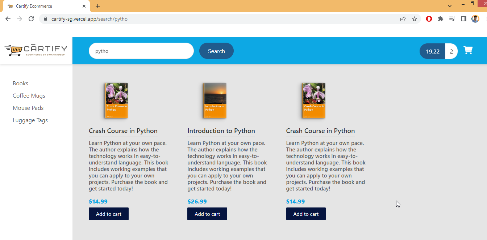

# Cartify Ecommerce Guide


## Introduction

Download the Source Code and PDF Files

**Download Source Code:** [https://github.com/darbyluv2code/fullstack-angular-and-springboot](https://github.com/darbyluv2code/fullstack-angular-and-springboot)

**Download PDF Files** : All slides which are shown during the course are available also as a reference and can be downloaded here:

[http://www.luv2code.com/download-full-stack-angular-and-springboot-pdf-slides](http://www.luv2code.com/download-full-stack-angular-and-springboot-pdf-slides)


**Design Requirements - Backend**

- Show a list of products 
- Add products to shopping cart (CRUD)
- Shopping cart check out 
- User login/logout security 
- Track previous orders for logged in users


### Release Plan

- **Release 1.0**
  - **Show a list of products**

- **Release 2.0**
  - **Add products to shopping cart (CRUD)**
  - **Shopping cart check out**

- **Release 3.0**
  - **User login/logout security**
  - **Track previous orders for logged in users**


**Release 2.0 - Plan**

- Online Shop Template Integration

- Search for products by category

- Search for products by text box

- Master / detail view of products

- Pagination support for products

- Add products to shopping cart (CRUD)

- Shopping cart check out


---

# **Backend 1.0**

**Development Process Backend - Release 1.0**

1. Set up the database tables 
2. Create a Spring Boot starter project (start.spring.io) with Dependencies : `web,data-rest,data-jpa,postgresql,lombok`
3. Develop the Entities: Product and ProductCategory 
4. Create REST APIs with Spring Data JPA Repositories and Spring Data REST
5. Add CrossOrigin support to Spring Boot app


### Database

We can connect postgres database from windows command line / powershell using below command 

```sh
cockroach sql --url "postgresql://swarnadeep:<<Password_here>>@free-tier12.aws-ap-south-1.cockroachlabs.cloud:26257/defaultdb?sslmode=verify-full&options=--cluster%3Dswarna-db-200"
```

**SELECT queries to check data** 

```sql
select * from "cartify_ecommerce".product_category pc ;
select * from "cartify_ecommerce".product p ;
```

**Insert Data in DB** 

```sql
INSERT INTO "cartify_ecommerce".product_category(id, category_name) VALUES (nextval('cartify_ecommerce.pc_seq'), 'BOOKS');

INSERT INTO "cartify_ecommerce".product (id, sku, name, description, image_url, active, units_in_stock, unit_price, category_id, date_created)
VALUES (nextval('cartify_ecommerce.product_seq'), 'BOOK-TECH-1000', 'JavaScript - The Fun Parts', 'Learn JavaScript',
'assets/images/products/placeholder.png' ,'1',100,19.99,1, NOW());

INSERT INTO "cartify_ecommerce".product (id, sku, name, description, image_url, active, units_in_stock, unit_price, category_id, date_created)
VALUES (nextval('cartify_ecommerce.product_seq'), 'BOOK-TECH-1001', 'Spring Framework Tutorial', 'Learn Spring',
'assets/images/products/placeholder.png' ,'1',100,29.99,1, NOW());

INSERT INTO "cartify_ecommerce".product (id, sku, name, description, image_url, active, units_in_stock, unit_price, category_id, date_created)
VALUES (nextval('cartify_ecommerce.product_seq'), 'BOOK-TECH-1002', 'Kubernetes - Deploying Containers', 'Learn Kubernetes',
'assets/images/products/placeholder.png' ,'1',100,24.99,1, NOW());

INSERT INTO "cartify_ecommerce".product (id, sku, name, description, image_url, active, units_in_stock, unit_price, category_id, date_created)
VALUES (nextval('cartify_ecommerce.product_seq'), 'BOOK-TECH-1003', 'Internet of Things (IoT) - Getting Started', 'Learn IoT',
'assets/images/products/placeholder.png' ,'1',100,29.99,1, NOW());

INSERT INTO "cartify_ecommerce".product (id, sku, name, description, image_url, active, units_in_stock, unit_price, category_id, date_created)
VALUES (nextval('cartify_ecommerce.product_seq'), 'BOOK-TECH-1004', 'The Go Programming Language: A to Z', 'Learn Go',
'assets/images/products/placeholder.png' ,'1',100,24.99,1, NOW());
```


***application.properties***

```properties
############### Spring REST ###############
spring.data.rest.base-path=/api

############### JPA config ###############
spring.jpa.hibernate.ddl-auto=update
spring.jpa.show-sql=true
# spring.jpa.defer-datasource-initialization=true
spring.sql.init.mode=always
#spring.datasource.initialization-mode=always #--> Or for Spring Boot before 2.5:

############### Connecting to Postgres Database ###############
spring.datasource.url=jdbc:postgresql://free-tier12.aws-ap-south-1.cockroachlabs.cloud:26257/swarna-db-200.defaultdb
spring.datasource.username=swarnadeep
spring.datasource.password=<<Password_here>>
spring.datasource.driver-class-name=org.postgresql.Driver
spring.jpa.properties.hibernate.dialect = org.hibernate.dialect.PostgreSQLDialect
```


### ProductCategory

Designed ProductCategory entity and Repository

***ProductCategory.java***

```java
package com.swarna.cartify.entity;
...
@Entity
@Data
@Table(name="product_category" , schema = "cartify_ecommerce")
public class ProductCategory {

    @Id
    @SequenceGenerator(name = "pc_seq",sequenceName = "pc_seq",allocationSize = 1, schema = "cartify_ecommerce")
    @GeneratedValue(strategy = GenerationType.SEQUENCE, generator = "pc_seq")
    @Column(name = "id")
    private long id;

    @Column(name = "category_name")
    private String categoryName;

    @OneToMany(cascade = CascadeType.ALL, mappedBy = "category")
    private Set<Product> products;
}
```

***ProductCategoryRepo.java***

```java
package com.swarna.cartify.repo;
import org.springframework.data.rest.core.annotation.RepositoryRestResource;

//RepositoryRestResource will change default endpoint, so that we can access data using '/api/product-category'
@RepositoryRestResource(collectionResourceRel = "productCategory", path = "product-category")
public interface ProductCategoryRepo extends JpaRepository<ProductCategory, Long> {
}
```


### Product

***Product.java***

```java
@Entity
@Data
@Table(name="product" , schema = "cartify_ecommerce")
public class Product {

    @Id
    @SequenceGenerator(name = "product_seq",sequenceName = "product_seq",allocationSize = 1, schema = "cartify_ecommerce")
    @GeneratedValue(strategy = GenerationType.SEQUENCE, generator = "product_seq")
    @Column(name = "id")
    private Long id;

    @ManyToOne
    @JoinColumn(name = "category_id", nullable = false)
    private ProductCategory category;

    @Column(name = "sku")
    private String sku;

    @Column(name = "name")
    private String name;

    @Column(name = "description")
    private String description;

    @Column(name = "unit_price")
    private BigDecimal unitPrice;

    @Column(name = "image_url")
    private String imageUrl;

    @Column(name = "active")
    private boolean active;

    @Column(name = "units_in_stock")
    private int unitsInStock;

    @Column(name = "date_created")
    @CreationTimestamp // Created timestamp will be updated automatically
    private Date dateCreated;

    @Column(name = "last_updated")
    @UpdateTimestamp // Last updated timestamp will be updated automatically
    private Date lastUpdated;
}
```

***ProductRepo.java***

```java
package com.swarna.cartify.repo;
...
public interface ProductRepo  extends JpaRepository<Product, Long>{
}
```


### Spring REST, CORS Config

Here we used `spring-boot-starter-data-rest` to avoid making Controller and let spring do that in background. By this, We can use all REST methods without creating Controller.

In ***application.properties***, we mentioned an endpoint, where all backend api calls will be added after that

```properties
spring.data.rest.base-path=/api
```


**Default Endpoints**

- By default, Spring Data REST will create endpoints based on entity type 
  - Simple pluralized form 
  - First character of Entity type is lowercase 
  - Then just adds an “s” to the entity 

**For example,** 

- if Repository will be : `public interface ProductRepo  extends JpaRepository<Product, Long>`
- Then Endpoint will be : `/products`
- *Spring Data REST will expose these endpoints for free!*

| HTTP Method | Endpoints      | CRUD Action                |
| ----------- | -------------- | -------------------------- |
| POST        | /products      | Create a new product       |
| GET         | /products      | Read a list of products    |
| GET         | /products/{id} | Read a single product      |
| PUT         | /products/{id} | Update an existing product |
| DELETE      | /products/{id} | Delete an existing product |


**Disable access for specific endpoints**

Now, I want the REST API as READ-ONLY , so I will **disable** access for POST , PUT and DELETE. So there is 2 options to do that.

- **Option 1**: Don't use Spring Data REST : Manually create our own @RestController and @GetMapping 
  - But we lose the Spring Data REST support for paging, sorting etc :-( 

- **Option 2**: Use Spring Data REST. I will prefer this. below is the config class for that.

MyDataRestConfig.java

```java
package com.swarna.cartify.config;
import com.swarna.cartify.entity.Product;
import com.swarna.cartify.entity.ProductCategory;
import org.springframework.context.annotation.Configuration;
import org.springframework.data.rest.core.config.RepositoryRestConfiguration;
import org.springframework.data.rest.webmvc.config.RepositoryRestConfigurer;
import org.springframework.http.HttpMethod;
import org.springframework.web.servlet.config.annotation.CorsRegistry;

@Configuration
public class MyDataRestConfig implements RepositoryRestConfigurer {

    @Override
    public void configureRepositoryRestConfiguration(RepositoryRestConfiguration config, CorsRegistry cors) {

        HttpMethod[] theUnsupportedActions = {HttpMethod.PUT, HttpMethod.POST, HttpMethod.DELETE, HttpMethod.PATCH};

        // disable HTTP methods for Product: PUT, POST, DELETE and PATCH
        config.getExposureConfiguration()
                .forDomainType(Product.class)
                .withItemExposure((metdata, httpMethods) -> httpMethods.disable(theUnsupportedActions))
                .withCollectionExposure((metdata, httpMethods) -> httpMethods.disable(theUnsupportedActions));

        // disable HTTP methods for ProductCategory: PUT, POST, DELETE and PATCH
        config.getExposureConfiguration()
                .forDomainType(ProductCategory.class)
                .withItemExposure((metdata, httpMethods) -> httpMethods.disable(theUnsupportedActions))
                .withCollectionExposure((metdata, httpMethods) -> httpMethods.disable(theUnsupportedActions));

        // Added for CORS allow origin
        cors.addMapping("/**").allowedOrigins("*")
            .allowedMethods("GET", "POST", "PUT", "DELETE", "OPTIONS")
            // .allowCredentials(false).maxAge(3600)
            ;
    }
}
```


**CorsConfig (Will not work for Spring Rest)**

***CorsConfig.java*** - To allow frontend domain fetch values from backend.

```java
// package com.swarna.cartify.config;
// ...
// @Configuration
// public class CorsConfig implements WebMvcConfigurer{

//     @Override
//     public void addCorsMappings(CorsRegistry registry) {
//         // WebMvcConfigurer.super.addCorsMappings(registry);
//         // registry.addMapping("/**").allowedOrigins(frontendURL)
//         registry.addMapping("/**").allowedOrigins("*")
//                 .allowedMethods("GET", "POST", "PUT", "DELETE", "OPTIONS");
//     }
// }
```


### Endpoints

```http
http://localhost:8080/api/products -- To see all products
http://localhost:8080/api/products/1 -- To check single product
http://localhost:8080/api/product-category -- To check all categories 
```


---

# **Frontend 1.0**

**Development Process Frontend - Release 1.0**

1. Create Angular project `ng new cartify-ui`
2. Create Angular component for product-list 
3. Develop TypeScript model class for Product `ng g class common/product`
4. Create Angular service to call REST APIs `ng g s services/productService`
5. Update Angular component to subscribe to data from Angular service 
6. Display the data in an HTML page


### Setup

**Create Angular project Setup**

```sh
$ ng new TodoList
$ cd Todolist
$ npm install bootstrap
$ npm install jquery
$ npm install @fortawesome/fontawesome-free
-- Downloaded versions: "bootstrap": "^4.4.1", "jquery": "^3.6.0",
```

Configure `angular.json` to activate bootstrap, Font-awesome and jquery

```json
"architect": {
    "build": {
        "builder": "@angular-devkit/build-angular:browser",
        "options": {
            "outputPath": "dist/course-api-ui",
            "index": "src/index.html",
            "main": "src/main.ts",
            "polyfills": "src/polyfills.ts",
            "tsConfig": "tsconfig.app.json",
            "assets": [
                "src/favicon.ico",
                "src/assets"
            ],
            "styles": [
              "src/styles.css",
              "./node_modules/bootstrap/dist/css/bootstrap.min.css",
              "./node_modules/@fortawesome/fontawesome-free/css/all.min.css"
            ],
            "scripts": [
              "./node_modules/jquery/dist/jquery.min.js",
              "./node_modules/bootstrap/dist/js/bootstrap.bundle.min.js"
            ]
        },
```

Included font-awesome icons in ***styles.css***

```css
@import url('https://maxcdn.bootstrapcdn.com/font-awesome/4.3.0/css/font-awesome.min.css');
```


 ***Product.ts* - Product model class**

```typescript
export class Product {
    sku: string;
    name: string;
    description: string;
    unitPrice: number;
    imageUrl: string;
    active: boolean;
    unitsInStock: number;
    dateCreated: Date;
    lastUpdate: Date;
}
```


### ProductService

 ***product.service.ts* - ProductService **

```typescript
...
export class ProductService {
  constructor(private http: HttpClient) {}

  public getAllProducts(): Observable<Product[]> {
    return this.http.get<GetResponse>(`${environment.apiServerUrl}/products`).pipe(
      map(response => response._embedded.products)) ;
  }
}

interface GetResponse {
  _embedded : {
    products : Product[];
  }
}
```


### product-list Component

***app.component.html***

```html
<div class="container">
    <h1 class="mt-3 mb-3">Products</h1>
    <app-product-list></app-product-list>
</div>
```


***product-list.component.html***

```html
<table class="table table-striped">
    <thead>
        <tr class="table-dark">
            <!-- <th scope="col">#</th> -->
            <th></th>
            <th scope="col">Name</th>
            <th scope="col">Price</th>
            <th scope="col">Units in Stock</th>
        </tr>
    </thead>
    <tbody>
        <tr *ngFor="let product of products">
            <!-- <th scope="row">{{product.}}</th> -->
            <td class="align-middle"></td>
            <td class="align-middle">{{product.name}}</td>
            <td class="align-middle">{{product.unitPrice | currency: 'USD'}}</td>
            <td class="align-middle">{{product.unitsInStock}}</td>
        </tr>
    </tbody>
</table>
```

***product-list.component.ts***

```typescript
export class ProductListComponent implements OnInit {
  products: Product[];

  constructor(private productService :ProductService) { }
  ngOnInit(): void {
    this.getAllProducts();
  }

  getAllProducts(){
    this.productService.getAllProducts().subscribe(
      data => { this.products = data })
  }
}
```


**Snapshot of Release 1.0**


---

# **Release 2.0**

- Online Shop Template Integration

- Search for products by category

- Search for products by text box

- Master / detail view of products

- Pagination support for products

- Add products to shopping cart (CRUD)

- Shopping cart check out


### Online Shop Template Integration

**Development Process**

1. Install Bootstrap and Fontawesome CSS styles locally using npm: `npm i bootstrap@4.4.1` and `npm i @fortawesome/fontawesome-free` . 

   Then add css and JS paths (Demonstrated Above Frontend 1.0 > Setup)

2. Add local custom CSS styles to Angular src/styles.css file

3. Integrate template files into Angular app

4. Add support for icons and logos

5. Enhance our application with product images


***app.component.html*** - writing only headlines here. For detail code, visit GitHub

```html
<!-- MENU SIDEBAR-->
...
<!-- HEADER DESKTOP-->
...
<!-- MAIN CONTENT of product list-->
<app-product-list></app-product-list>
...
<!-- FOOTER STARTS -->
```

***product-list.component.html***

```html
<div class="main-content">
    <div class="section-content section-content-p30">
        <div class="container-fluid">
            <div class="row">

                <!-- Loop over the products -->
                <div  *ngFor="let product of products" class="col-md-3">
                    <div class="product-box">
                        <a href="product-detail.html">
                            
                        </a>
                        <a href="product-detail.html">
                            <h1>{{ product.name }}</h1>
                        </a>
                        <h2>{{ product.description }} </h2>
                        <div class="price">{{ product.unitPrice | currency: 'USD' }}</div>
                        <a href="#" class="primary-btn">Add to cart</a>
                    </div>
                </div>
            </div>
        </div>
    </div>
</div>
```

> Spring REST gives 20 records by default , wheather there is any number of records or not
>
> We need to use **`${environment.apiServerUrl}/products?size=100`  to get all 100 products in frontend service ts file.**


Snapshot


### FindByCategory

**Development Process**

1. Define routes and Configure Router based on our routes , Define the Router Outlet

4. Set up Router Links to pass category id param

5. Enhance ProductListComponent to read category id param

6. Modify Spring Boot app - REST Repository needs new method

7. Update Angular Service to call new URL on Spring Boot app


#### Backend- FindByCategory

***ProductRepo.java***

```java
package com.swarna.cartify.repo;
import org.springframework.data.domain.Page;
import org.springframework.data.domain.Pageable;
...
@RepositoryRestResource
public interface ProductRepo  extends JpaRepository<Product, Long>{

    //API will be => http://localhost:8080/api/products/search/findByCategoryId/?id=2
    Page<Product> findByCategoryId(@RequestParam("id") Long id, Pageable pageable);
}
```


#### Frontend- FindByCategory

**Adding Angular Routing first**

***app-routing.module.ts***

```typescript
import { NgModule } from '@angular/core';
import { RouterModule, Routes } from '@angular/router';
import { ProductListComponent } from './components/product-list/product-list.component';

const routes: Routes = [
  { path: 'category/:id', component: ProductListComponent },
  { path: 'category', component: ProductListComponent },
  { path: 'products', component: ProductListComponent },
  { path: '', redirectTo: '/products', pathMatch: 'full' },
  { path: '**', redirectTo: '/products', pathMatch: 'full' },
];

@NgModule({
  imports: [RouterModule.forRoot(routes)],
  exports: [RouterModule],
})
export class AppRoutingModule {}
```

***app.module.ts***

```typescript
import { AppRoutingModule } from './app-routing.module';
...
  imports: [...
    AppRoutingModule,
  ],
```

***app.component.html***

```html
...
            <nav class="navbar-sidebar">
                <ul class="list-unstyled navbar-list">
                    <li><a routerLink="/category/1" routerLinkActive="active-link">Books</a></li>
                    <li><a routerLink="/category/2" routerLinkActive="active-link">Coffee Mugs</a></li>
                    <li><a routerLink="/category/3" routerLinkActive="active-link">Mouse Pads</a></li>
                    <li><a routerLink="/category/4" routerLinkActive="active-link">Luggage Tags</a></li>
	...
        <!-- MAIN CONTENT-->
        <router-outlet></router-outlet>
        <!-- END MAIN CONTENT-->
```


***product.service.ts***

```typescript
...
public getProductsByCategory(currentCategoryId: number): Observable<Product[]> {
    return this.http.get<GetResponse>(`${environment.apiServerUrl}/products/search/findByCategoryId/?id=${currentCategoryId}`).pipe(
      map(response => response._embedded.products)
    ) ;
...
```

***product-list.component.ts*** - Fetching Parameter from URL using Activated route and calling service method

```typescript
export class ProductListComponent implements OnInit {
  products: Product[];
  currentCategoryId: number;

  constructor(private productService: ProductService, private route: ActivatedRoute ) {}

  ngOnInit(): void {
    this.route.paramMap.subscribe(() => {
      this.getAllProducts();
    });
  }

  getAllProducts() {

    //check if "id" parameter is available
    const hascategoryId: boolean = this.route.snapshot.paramMap.has('id');

    if(hascategoryId){
      // get the "id" parameter and converting to number using "+" symbol
      this.currentCategoryId = +this.route.snapshot.paramMap.get('id');
    } else{
      // if no category id available, default set to 1
      this.currentCategoryId = 1;
    }

    this.productService.getProductsByCategory(this.currentCategoryId).subscribe((data) => {
      this.products = data;
    });
  }
}
```

Snapshot


### FindByCategory Dynamically

**Development Process**

1. Modify Spring Boot app - Expose entity ids - Backend

2. Create a class: ProductCategory : `ng g class common/product-category`

3. Create new component for menu : `ng g c components/product-category-menu`

4. Enhance menu component to read data from product service

5. Update product service to call URL on Spring Boot app

6. In HTML, replace hard-coded links with menu component


#### Backend - FindByCategory Dynamic

**Goal :** 

```json
API : https://cartify-ecommerce-fullstack.herokuapp.com/api/product-category

From : There is no entity id at the productCategory level, so no easy access
{
  "_embedded" : {
    "productCategory" : [ {
      "categoryName" : "Books",
      "_links" : {
	 
To this : 
{
  "_embedded" : {
    "productCategory" : [ {
      "id" : 1,
      "categoryName" : "Books",
	  
```


***MyDataRestConfig.java***

```java
public class MyDataRestConfig implements RepositoryRestConfigurer {
    @Autowired
    private EntityManager entityManager;
...
        // call an internal helper method
        exposeIds(config);
    }

    private void exposeIds(RepositoryRestConfiguration config) {
        //expose entity ids
        // - get a list of all entity classes from the entity manager
        Set<EntityType<?>> entities = entityManager.getMetamodel().getEntities();

        // - create an array of the entity types
        List<Class> entityClasses = new ArrayList<>();

        // - get the entity types for the entities
        for (EntityType tempEntityType : entities) {
            entityClasses.add(tempEntityType.getJavaType());
        }

        // - expose the entity ids for the array of entity/domain types
        Class[] domainTypes = entityClasses.toArray(new Class[0]);
        config.exposeIdsFor(domainTypes);
    }
}
```


#### Frontend- FindByCategory Dynamic

***product-category.ts***

```typescript
export class ProductCategory {
  id: number;
  categoryName: string;
}
```


***product.service.ts***

```typescript
...
  getProductCategories(): Observable<ProductCategory[]> {
    return this.http
      .get<GetResponseProductCategory>(`${environment.apiServerUrl}/product-category`)
      .pipe(map((response) => response._embedded.productCategory));
  }
}
interface GetResponseProductCategory {
  _embedded: {
    productCategory: ProductCategory[];
  };
}
```


***app.component.html***

```html
<!--<div class="menu-sidebar-content js-scrollbar1"> ... </div> -->

Above DIV of sidebar will be replaced by below.
<app-product-category-menu></app-product-category-menu>
```


***product-category-menu.component.html***

```html
<!-- Dynamic Category name coming from database -->
<div class="menu-sidebar-content js-scrollbar1">
    <nav class="navbar-sidebar">
        <ul class="list-unstyled navbar-list">
            <!-- <li>
                <a routerLink="/category/1" routerLinkActive="active-link">Books</a>
            </li> -->
            <li *ngFor="let tempProductCategory of productCategories">
                <a routerLink="/category/{{ tempProductCategory.id }}" routerLinkActive="active-link">
                    {{ tempProductCategory.categoryName }}
                </a>
            </li>
        </ul>
    </nav>
</div>
```

***product-category-menu.component.html***

```typescript
export class ProductCategoryMenuComponent implements OnInit {
  productCategories: ProductCategory[];
  constructor(private productService: ProductService) {}
  ngOnInit() {
    this.listProductCategories();
  }

  listProductCategories() {
    this.productService.getProductCategories().subscribe((data) => {
      console.log('Product Categories=' + JSON.stringify(data));
      this.productCategories = data; });
  }
}
```


### SearchProduct by Keyword

**Development Process**

1. Modify Spring Boot app - Add a new search method

2. Create new component for search

3. Add new Angular route for searching

4. Update SearchComponent to send data to search route

5. Enhance ProductListComponent to search for products with ProductService

6. Update ProductService to call URL on Spring Boot app


***ProductRepo.java*** -  Backend - Find products based on name

```java
//API will be => http://localhost:8080/api/products/search/findByNameContainingIgnoreCase?name=Pyth
Page<Product> findByNameContainingIgnoreCase(@RequestParam("name") String name, Pageable pageable);
```


#### Frontend- Search ProductBy Keyword

***product.service.ts***

```typescript
searchProducts(keyword: string): Observable<Product[]> {
    const searchUrl = `${environment.apiServerUrl}/products/search/findByNameContainingIgnoreCase?name=${keyword}`;
    return this.getProduct(searchUrl);
  }

private getProduct(searchUrl: string): Observable<Product[]> {
    return this.http
      .get<GetResponseProducts>(searchUrl)
      .pipe(map((response) => response._embedded.products));
}
```

***app-routing.module.ts***

```typescript
{ path: 'search/:keyword', component: ProductListComponent },
```

***app-component.html*** - Sepeated search form from the header into a seperate component

```html
<!-- Search Form header -->
<app-search></app-search>
```


***search.component.html*** - Sepeated search form from the header into a seperate component

```html
<div class="form-header">
    <input #myInput type="text" placeholder="Search for products ..." class="au-input au-input-xl"
        (keyup.enter)="doSearch(myInput.value)" />
    <button (click)="doSearch(myInput.value)" class="au-btn-submit">
        Search
    </button>
</div>
```

***search.component.ts*** - taking value and navigating to Product list component

```typescript
export class SearchComponent implements OnInit {
  constructor(private router: Router) {}
  ngOnInit(): void {}

  doSearch(value: string) {
    console.log(`value=${value}`);
    this.router.navigateByUrl(`/search/${value}`);
  }
}
```


***product-list.component.ts*** - refactored as per search component

```typescript
export class ProductListComponent implements OnInit {
  products: Product[];
  currentCategoryId: number;
  isSearchActive: boolean;
    
  constructor(private productService: ProductService, private route: ActivatedRoute ) {}
  ngOnInit(): void {
    this.route.paramMap.subscribe(() => {
      this.listProducts();
    });
  }

  listProducts() {
    this.isSearchActive = this.route.snapshot.paramMap.has('keyword');

    if (this.isSearchActive) {
      this.handleSearchProducts();
    } else {
      this.handleListProducts();
    }
  }

  handleListProducts() {
    //check if "id" parameter is available
    const hascategoryId: boolean = this.route.snapshot.paramMap.has('id');

    if (hascategoryId) {
      // get the "id" parameter and converting to number using "+" symbol
      this.currentCategoryId = +this.route.snapshot.paramMap.get('id');
    } else {
      // if no category id available, default set to 1
      this.currentCategoryId = 1;
    }

    this.productService
      .getProductsByCategory(this.currentCategoryId)
      .subscribe((data) => {
        this.products = data;
      });
  }

  handleSearchProducts() {
    const keyword: string = this.route.snapshot.paramMap.get('keyword');

    this.productService.searchProducts(keyword).subscribe((data) => {
      this.products = data;
    });
  }
}
```

***product-list.component.html*** - Added 404 product not found message

```html
<!-- if products empty then display a message-->
<div *ngIf="products?.length == 0" class="alert alert-warning col-md-12" role="alert">
    No products found for given keyword.
</div>
```


Snapshot : 




### **Product Detail Page**

Development Process

1. Create new component for product details : `ng g c components/ProductDetails`

2. Add new Angular route for product details

3. Add router links to the product-list-grid HTML page

4. Enhance ProductDetailsComponent to retrieve product from ProductService

5. Update ProductService to call URL on Spring Boot app

6. Update HTML page for ProductDetailsComponent to display product details


***product.ts*** - added id in model

```typescript
export class Product {
    id: string;
	...
}
```

***app-routing.module.ts***

```typescript
{ path: 'products/:id', component: ProductDetailsComponent },
```

***product-list.component.html***

```html
<div class="product-box">
    <a routerLink="/products/{{product.id}}">
        
    </a>
    <a routerLink="/products/{{product.id}}">
        <h1>{{ product.name }}</h1>
    </a>
```

***product.service.ts***

```typescript
getProduct(theProductId: number): Observable<Product> {
    const productUrl = `${environment.apiServerUrl}/products/${theProductId}`;
    return this.http.get<Product>(productUrl);
}
```


***product-details.component.html*** 

```html
<div class="detail-section">
    <div class="container-fluid">
        
        <h3>{{ product.name }}</h3>
        <div class="price">{{ product.unitPrice | currency:'USD' }}</div>
        <a href="#" class="primary-btn">Add to cart</a>
        <hr>
        <h4>Description</h4>
        <p>{{ product.description }}</p>
        <a routerLink="/products" class="mt-5">Back to Product List</a>
    </div>
</div>
```

***product-details.component.css***

```css
.detail-img{
    width: 300px;
}
```

***product-details.component.ts***

```typescript
export class ProductDetailsComponent implements OnInit {
    product: Product = new Product();

    constructor(private productService: ProductService, private route: ActivatedRoute ) {}

    ngOnInit(): void { this.getProduct();}

    getProduct() {
        const theProductId: number = +this.route.snapshot.paramMap.get('id');

        this.productService.getProduct(theProductId).subscribe((data) => {
            this.product = data; });
    }
}
```


Snapshot


## **Pagination**

- Pagination is useful for handling large amounts of data 
- Show the users a small subset of data: "page" of data 
- The user can click links to view other pages


#### Pagination - Backend

- *Spring Data REST provides pagination support out of the box*
- By default, Spring Data REST returns: 20 elements 
- We can customize this by passing in parameters

| Parameter | Purpose                                                      |
| --------- | ------------------------------------------------------------ |
| page      | The page number to access. 0-based ... defaults to 0         |
| size      | The size of the page to return (items per page). Defaults to 20 |


So if we go to [/products/?page=0&size=10](https://cartify-ecommerce-fullstack.herokuapp.com/api/products/?page=0&size=10)

It will return first page of 10 elements. And in response JSON, we can find below metadata : 

```json
{
    "_embedded": {
        "products": [ ... ]
    },
    "_links": { ... },
    "page": {
        "size": 10, 			// Current page element size
        "totalElements": 101,	// count of total elements
        "totalPages": 11,		// total pages
        "number": 0 			// Current Page Number
    }
}
```


#### Pagination - Frontend

We will use [ng-bootstrap](https://ng-bootstrap.github.io/) for the same.

**Pagination component**

| Parameter      | Purpose                                               |
| -------------- | ----------------------------------------------------- |
| page           | The page number to access. 1-based ... defaults to 1  |
| pageSize       | The size of the page (items per page). Defaults to 10 |
| collectionSize | The total number of items                             |
| pageChange     | Event handler for page change events                  |


**Development Process**

1. Install ng-bootstrap -> `ng add @angular/localize`, `npm install @ng-bootstrap/ng-bootstrap` (10.0.0) , `npm install @popperjs/core`

2. **Refactor the interface for: GetResponseProducts**

   The response meta data coming from backend also has valuable information for pagination. Spring REST Provide pagination out of the box. 

   ```typescript
   << array of products >>
       ...
       "page" : {
       "size" : 20,
       "totalElements" : 100,
       "totalPages" : 5,	// Total pages available
       "number" : 0	// Current page number
   }
   ```

   

   ***product.service.ts*** - GetResponseProducts interface Maps JSON data from REST API to our TypeScript objects

   ```typescript
   interface GetResponseProducts {
     _embedded: {
       products: Product[];
     };
     page: {
       size: number;
       totalElements: number;
       totalPages: number;
       number: number;
     };
   }
   ```

   

3. **Add pagination support to ProductService**

   ***product.service.ts*** - Getting products based on Category Id, Page number and Page size

   ```typescript
    // Getting products based on Category Id, Page number and Page size
     public getProductsByCategoryPaginate(page: number, pageSize: number, currentCategoryId: number): Observable<GetResponseProducts> {
       const url = `${environment.apiServerUrl}/products/search/findByCategoryId/?id=${currentCategoryId}&page=${page}&size=${pageSize}`;
       return this.http.get<GetResponseProducts>(url);
     }
   ```

   

4. **Update ProductListComponent to handle pagination**

   ***product-list.component.ts*** - Getting products based on Category Id, Page number and Page size

   ```typescript
   export class ProductListComponent implements OnInit {
       // new properties for pagination
       thePageNumber: number = 1;
       thePageSize: number = 10;
       theTotalElements: number = 0;
       ...
       handleListProducts() {
           ...
           // now get the products for the given category id
           // frontend pagination starts from pageNumber = 1, for backend its 0, thatswhy substracting by 1 to send to backend
           this.productService.getProductsByCategoryPaginate(
               this.thePageNumber - 1,
               this.thePageSize,
               this.currentCategoryId
           )
               .subscribe(this.processResult());
       }
   
       processResult() {
           return (data) => {
               this.products = data._embedded.products;
               // frontend pagination starts from pageNumber = 1, for backend its 0, thatswhy adding by 1 to show in UI
               this.thePageNumber = data.page.number + 1;
               this.thePageSize = data.page.size;
               this.theTotalElements = data.page.totalElements;
           };
       }
   }
   ```

   

5. **Enhance HTML template to use ng-bootstrap pagination component**

   ***product-list.component.html*** - Getting products based on Category Id, Page number and Page size

   ```html
   <!-- Footer Pagination starts -->
   <div class="footer-pagination">
       <div class="row">
           <div class="col-md-6"></div>
   
           <div class="col-md-6">
               <div class="row">
                   <div class="col-md-9" style="padding-left: 30%">
   
                       <ngb-pagination [(page)]="thePageNumber" 
                                       [pageSize]="thePageSize"
                                       [collectionSize]="theTotalElements" 
                                       (pageChange)="listProducts()">
                       </ngb-pagination>
   
                   </div>
                               
                   <!-- Change Page Size from UI -->
                   <div class="col-md-3 mt-2" style="text-align: right;">
                       <span class="mr-2">Page Size</span>
   
                       <select (change)="updatePageSize($event)">
                           <option selected="true">5</option>
                           <option>10</option>
                           <option>20</option>
                           <option>50</option>
                       </select>
                   </div>
   
               </div>
           </div>
   
       </div>
   </div>
   <!-- Footer Pagination ends -->
   ```

   

6. **Pagination - Change PageSize fron frontend**

   HTML Change is already added in above code block.

   ***product-list.component.ts*** - writing `updatePageSize()` method 

   ```typescript
   updatePageSize(event: Event) {
       this.thePageSize = parseInt((event.target as HTMLInputElement).value);
       this.thePageNumber = 1;
       this.listProducts();
   }
   ```

   

7. **Similarly activate pagination in SearchProducts**

   ***product.service.ts*** - Getting products based on Category Id, Page number and Page size

   ```typescript
   searchProductsPaginate(page: number, pageSize: number, keyword: string): Observable<GetResponseProducts> {
       const searchUrl = `${environment.apiServerUrl}/products/search/findByNameContainingIgnoreCase?name=${keyword}&page=${page}&size=${pageSize}`;
       return this.http.get<GetResponseProducts>(searchUrl);
     }
   ```

   ***product-list.component.ts*** - writing `updatePageSize()` method 

   ```typescript
   handleSearchProducts() {
       const keyword: string = this.route.snapshot.paramMap.get('keyword');
   
       this.productService
           .searchProductsPaginate(this.thePageNumber - 1, this.thePageSize, keyword)
           .subscribe(this.processResult());
   }
   ```


**Snapshot**


---

## **Shopping Cart**

**Overview of Entire Shopping Cart Process**

1. Cart Status Component: on main page, display total price and quantity (With Add to Cart Functionality)

2. Cart Details Page: list the items in the cart

3. Cart Details Page: add / remove items

4. Checkout Button

5. Checkout Form


### Cart Status Component

#### **Development Process- Part 1**

1. Create new component: CartStatusComponent `ng generate component components/cart-status`

2. Add HTML template for CartStatusComponent

   ***cart-status.component.html***

   ```html
   <div class="cart-area d-n">
       <a href="shopping-detail.html">
           <div class="total">{{ totalPrice | currency: 'USD' }}
               <span> {{ totalQuantity }} </span>
           </div>
           <i class="fa fa-shopping-cart" aria-hidden="true"></i>
       </a>
   </div>
   ```

3. Add click handler for "Add to cart" button

   ***product-list.component.html***

   ````html
   <div *ngFor="let product of products" class="col-md-3">
       ...
       <!-- <a routerLink="/" class="primary-btn">Add to cart</a> -->	    <!-- Previous  -->
       <button (click)="addToCart(product)" class="btn btn-primary btn-sm">Add to cart</button> <!-- Current  --> 
       ...
   </div>
   ````

4. Update ProductListComponent with click handler method

   ***product-list.component.ts***

   ```typescript
   addToCart(product: Product){
       console.log(`Adding to cart: ${product.name}, ${product.unitPrice}`);
       // TODO .. do the real work
       const theCartItem = new CartItem(product);
       this.cartService.addToCart(theCartItem);
   }
   ```


#### **Development Process- Part 2**

1. Create model class: CartItem:  `ng g class common/cart-item`

    ***cart-item.ts***

   ```typescript
   export class CartItem {
     id: string;
     name: string;
     imageUrl: string;
     unitPrice: number;
     
     quantity: number;
   
     constructor(product: Product) {
       this.id = product.id;
       this.name = product.name;
       this.imageUrl = product.imageUrl;
       this.unitPrice = product.unitPrice;
   
       this.quantity = 1;
     }
   }
   ```

   

2. Develop CartService :  `ng g service services/cart`

   ***cart-service.ts***

   ```typescript
   export class CartService {
     cartItems: CartItem[] = [];
   
     // Subject is a subclass of Observable. We can use Subject to publish events in our code,
     // The event will be sent to all of the subscribers
     totalPrice: Subject<number> = new Subject<number>();
     totalQuantity: Subject<number> = new Subject<number>();
   
     constructor() {}
   
     addToCart(theCartItem: CartItem) {
       let alreadyExistsInCart: boolean = false; // check if we already have the item in our cart
       let existingCartItem: CartItem = undefined;
   
       if (this.cartItems.length > 0) {
         for (let tempCartItem of this.cartItems) {
           if (tempCartItem.id === theCartItem.id) {
             //find the item in the cart based on item id
             existingCartItem = tempCartItem;
             break;
           }
         }
   
         alreadyExistsInCart = existingCartItem != undefined; // check if we found it
       }
   
       if (alreadyExistsInCart) {
         existingCartItem.quantity++; // increment the quantity
       } else {
         this.cartItems.push(theCartItem); // just add the item to the array
       }
   
       this.computeCartTotals(); // compute cart quantity and cart total
     }
   
     computeCartTotals() {
       let totalPriceValue: number = 0;
       let totalQuantityValue: number = 0;
   
       for (let currentCartItem of this.cartItems) {
         totalPriceValue += currentCartItem.quantity * currentCartItem.unitPrice;
         totalQuantityValue += currentCartItem.quantity;
       }
   
       // publish the new values ... all subscribers will receive the new data
       this.totalPrice.next(totalPriceValue);
       this.totalQuantity.next(totalQuantityValue);
   
       this.logCartData(totalPriceValue, totalQuantityValue);
     }
   
     logCartData(totalPriceValue: number, totalQuantityValue: number) {
       console.log("Contents of the Cart : ");
       for(let tempCartItem of this.cartItems){
         const subTotalPrice = tempCartItem.quantity * tempCartItem.unitPrice;
         console.log(`name=${tempCartItem.name} , quantity=${tempCartItem.quantity}, unitPrice=${tempCartItem.unitPrice}, subTotalPrice=${subTotalPrice}`);
       }
       console.log(`totalPrice= ${totalPriceValue.toFixed(2)}, totalQuantity= ${totalQuantityValue}`);
       console.log("-------");
     }
   
   }
   ```

   

3. Modify ProductListComponent to call CartService

   ***product-list.component.ts***

   ```typescript
   addToCart(product: Product){
       console.log(`Adding to cart: ${product.name}, ${product.unitPrice}`);
       // TODO .. do the real work
       const theCartItem = new CartItem(product);
       this.cartService.addToCart(theCartItem);
   }
   ```


4. Enhance CartStatusComponent to subscribe to CartService

   ***cart-status.component.ts***

   ```typescript
   export class CartStatusComponent implements OnInit {
     totalPrice: number = 0.0;
     totalQuantity: number = 0;
   
     constructor(private cartService: CartService) {}
     ngOnInit(): void {
       this.updateCartStatus();
     }
   
     updateCartStatus() {
       // subscribe to the cart status totalPrice
       this.cartService.totalPrice.subscribe((data) => (this.totalPrice = data));
   
       this.cartService.totalQuantity.subscribe(
         (data) => (this.totalQuantity = data) // subscribe to the cart status totalQuantity
       );
     }
   
   }
   ```

5. Update CartStatusComponent HTML to display cart total price and quantity

   ***cart-status.component.html***

   ```html
   <div class="total">{{ totalPrice | currency: 'USD' }}
       <span>{{ totalQuantity }}</span>
   </div>
   ```

   

#### **Add to Cart- Product Details View**

1. Add click handler for "Add to cart" button on product-details.component.html 

   ***product-details.component.html***

   ```html
   <button (click)="addToCart()" class="btn btn-primary btn-sm">Add to cart</button>
   ```

2. Update ProductDetailsComponent with click handler method

   ***product-details.component.ts***

   ```typescript
   addToCart() {
       console.log(`Adding to cart: ${this.product.name}, ${this.product.unitPrice}`);
       const theCartItem = new CartItem(this.product);
       this.cartService.addToCart(theCartItem);
   }
   ```


**Snapshot** : Add to Cart is working from all pages and cart status component is updating , also printing final cart status in console.


### **Cart-Detail List**

**Development Process**

1. Create new component: CartDetailsComponent `ng generate component components/cart-details`

2. Add new route for CartDetailsComponent

   ***app-routing.module.ts***

   ```typescript
   const routes: Routes = [
     { path: 'cart-details', component: CartDetailsComponent },
       ...
   ```

3. Update link for Shopping Cart icon

   ***cart-status.component.html***

   ```html
   <div class="cart-area d-n">
       <a routerLink="/cart-details">
           ...
       </a>
   </div>
   ```

   

4. Modify CartDetailsComponent to retrieve cart items

   ***cart-details.component.ts***

   ```typescript
   export class CartDetailsComponent implements OnInit {
       cartItems: CartItem[] = [];
       totalPrice: number = 0;
       totalQuantity: number = 0;
   
       constructor(private cartService: CartService) {}
   
       ngOnInit() {
           this.listCartDetails();
       }
   
       listCartDetails() {
           this.cartItems = this.cartService.cartItems; // get a handle to the cart items
   
           // subscribe to the cart totalPrice
           this.cartService.totalPrice.subscribe((data) => (this.totalPrice = data));
   
           // subscribe to the cart totalQuantity
           this.cartService.totalQuantity.subscribe(
               (data) => (this.totalQuantity = data)
           );
   
           this.cartService.computeCartTotals(); // compute cart total price and total quantity
       }
   }
   
   ```

   

5. Add HTML template for CartDetailsComponent

   ***cart-details.component.html***

   ```html
   <div class="main-content">
       <div class="section-content section-content-p30">
           <div class="container-fluid">
   
               <div *ngIf="cartItems.length > 0">
   
                   <table class="table table-bordered">
   
                       <tr>
                           <th width="20%">Product Image</th>
                           <th width="50%">Product Detail</th>
                           <th width="30%"></th>
                       </tr>
   
                       <tr *ngFor="let tempCartItem of cartItems">
                           <td>
                               
                           </td>
                           <td>
                               <p>{{ tempCartItem.name }}</p>
                               <p>{{ tempCartItem.unitPrice | currency:'USD' }} </p>
                           </td>
                           <td>
                               <div class="items">
                                   <label>Quantity:</label>
   
                                   <div class="row no-gutters">
                                       <div class="col p-1">
                                           <button (click)="incrementQuantity(tempCartItem)"
                                                   class="btn btn-success btn-sm"><i class="fas fa-plus"></i></button>
   
                                       </div>
                                       <div class="col ml-4 mr-2 p-1">
                                           {{ tempCartItem.quantity }}
                                       </div>
                                       <div class="col p-1">
                                           <button (click)="decrementQuantity(tempCartItem)"
                                                   class="btn btn-info btn-sm"><i class="fas fa-minus"></i></button>
                                       </div>
   
                                       <div class="col p-1">
                                           <button (click)="remove(tempCartItem)" class="btn btn-danger btn-sm">Remove</button>
                                       </div>
                                   </div>
   
                               </div>
   
                               <p class="mt-2">Subtotal: {{ tempCartItem.quantity * tempCartItem.unitPrice | currency:
                                   'USD' }}
                               </p>
                           </td>
                       </tr>
                       <tr>
                           <td colspan="2"></td>
                           <td style="font-weight: bold">
                               <p>Total Quantity: {{ totalQuantity }}</p>
                               <p>Shipping: FREE</p>
                               <p>Total Price: {{ totalPrice | currency: 'USD' }}</p>
                           </td>
                       </tr>
   
                   </table>
   
               </div>
   
               <div *ngIf="cartItems.length == 0" class="alert alert-warning col-md-12" role="alert">
                   Your shopping Cart is empty. Please add something.
               </div>
   
           </div>
       </div>
   </div>
   ```

   

**Adding Increment,Decrement,Remove feature in Cart Item**

Development Process

1. Modify CartDetailsComponent HTML template

   - Add the "increment, decrement, remove" button *-- (Already added in above component html code)*

   - Add click handler for the "increment, decrement, remove" button on HTML template  *-- (Already added in above component html code)*

     

2. Update CartDetailsComponent with click handler method for increment, decrement and remove

   ***cart-details.component.ts***

   ```typescript
   incrementQuantity(theCartItem: CartItem) {
       this.cartService.addToCart(theCartItem);
   }
   
   decrementQuantity(theCartItem: CartItem) {
       this.cartService.decrementQuantity(theCartItem);
   }
   
   remove(theCartItem: CartItem) {
       this.cartService.remove(theCartItem);
   }
   ```

3. Modify CartService with supporting method for decrementing and removing items

   ***cart.service.ts*** - 

   ```typescript
   decrementQuantity(theCartItem: CartItem) {
       theCartItem.quantity--;
   
       if (theCartItem.quantity === 0) {
           this.remove(theCartItem);
       } else {
           this.computeCartTotals();
       }
   }
   
   remove(theCartItem: CartItem) {
       // get index of item in the array
       const itemIndex = this.cartItems.findIndex(
           (tempCartItem) => tempCartItem.id == theCartItem.id
       );
   
       // if found, remove the item from the array at the given index
       if (itemIndex > -1) {
           this.cartItems.splice(itemIndex, 1);
           this.computeCartTotals();
       }
   }
   
   ```


**Snapshot**


---

## **Checkout Form**

Angular provides two types of forms • Reactive forms • Template-driven forms.

- Reactive forms - *We will use this.*

  - Leverages programmatic API for form building

  - Scaleable solution that is designed for large, complex forms

  - Forms can be easily reused and tested

- Template-driven forms

  - Targeted for small, simple forms

  - Not a scalable solution for large, complex forms

| Name        | Description                                                  |
| ----------- | ------------------------------------------------------------ |
| FormControl | Individual control that tracks the value and validation status |
| FormGroup   | A collection of controls. Can create nested groups.          |


### Form Layout

Development Process

1. Generate our checkout component : `ng g c components/checkout`

2. Add a new route for checkout component

   ***app-routing.module.ts***

   ```typescript
   const routes: Routes = [
       {path: 'checkout', component: CheckoutComponent},
       ...
   ```

   

3. Create a new checkout button and link to checkout component

   ***cart-details.component.ts***

   ```typescript
   <a routerLink='/checkout' class="btn btn-primary">Checkout</a>
   ```

4. Add support for reactive forms

   ***app.module.ts***

   ```typescript
   imports: [ ...
       ReactiveFormsModule
   ],
   ```

   

5. Define form in component .ts file and add method to call on Form submit

   ***checkout.component.ts***

   ```typescript
   export class CheckoutComponent implements OnInit {
       checkoutFormGroup: FormGroup;
       constructor(private formBuilder: FormBuilder) { }
       ngOnInit(): void {
           this.checkoutFormGroup = this.formBuilder.group({
               customer: this.formBuilder.group({
                   firstName: [''],
                   lastName: [''],
                   email: ['']
               })
               // Similarly we need to add other form elements like this
           });
       }
       onSubmit() {
           console.log("Handling the submit button");
           console.log(this.checkoutFormGroup.get('customer').value);
       }
   }
   ```

   

6. Layout form controls in HTML template

   ***checkout.component.html***

   ```html
   <form [formGroup]="checkoutFormGroup" (ngSubmit)="onSubmit()">
       <!-- customer form group -->
       <div formGroupName="customer" class="form-area">
           <h3>Customer</h3>
           <div class="row">
               <div class="col-md-2"> <label>First Name</label></div>
               <input formControlName="firstName" type="text">
           </div>
           <!-- Similarly we need to add other form elements like this-->
       </div>
       <div class="text-center">
           <button type="submit" class="btn btn-info">Purchase</button>
       </div>
       ...
   </form>
   ```

> - Complete updated checkout component html file here : [GitHub Link](https://github.com/SwarnadeepGhosh/cartify-ecommerce/tree/master/cartify-ui/src/app/components/checkout/checkout.component.html)
> - Complete updated checkout component TypeScript file here : [GitHub Link](https://github.com/SwarnadeepGhosh/cartify-ecommerce/tree/master/cartify-ui/src/app/components/checkout/checkout.component.ts)


**Snapshots:** 


### Populate Date Dropdowns

Checkout Form Populate Credit Card Expiration Dates. Here **Month is dependable on Year**. First we will get the year, and on the basis of year, we will provide month values.

Development Process

1. Generate our form service: CheckoutFormService; ` ng generate service services/CheckoutFormService`

2. Add methods to the form service for months and years

   ***checkout-form.service.ts***

   ```typescript
   export class CheckoutFormService {
       constructor() {}
   
       getCreditCardMonths(startMonth: number): Observable<number[]> {
           let data: number[] = [];
           // build an array for "Month" dropdown list, start at desired startMonth and loop until 12
           for (let theMonth = startMonth; theMonth <= 12; theMonth++) {
               data.push(theMonth);
           }
           return of(data); // The "of" operator from rxjs, will wrap an object as an Observable
       }
   
       getCreditCardYears(): Observable<number[]> {
           let data: number[] = [];
           // build an array for "Year" dropdown list, start at current year and loop for next 10
           const startYear: number = new Date().getFullYear(); // Curent year
           const endYear: number = startYear + 10;
   
           for (let theYear = startYear; theYear <= endYear; theYear++) {
               data.push(theYear);
           }
           return of(data); // The "of" operator from rxjs, will wrap an object as an Observable
       }
   }
   ```

   

3. Update checkout component to retrieve the months and years from service

   ***checkout.component.ts***

   ```typescript
   creditCardYears: number[] = [];
   creditCardMonths: number[] = [];
   ngOnInit(): void {
       ...
       // populate credit card years
       this.luv2ShopFormService.getCreditCardYears().subscribe(
           data => {
               console.log("Retrieved credit card years: " + JSON.stringify(data));
               this.creditCardYears = data;
           }
       );
       
       // no need to add month here as it will be auto populated depending on year
   }
   ```

4. Update HTML template to populate drop-down lists for months and years -- *Already completed and updated: [GitHub Link](https://github.com/SwarnadeepGhosh/cartify-ecommerce/tree/master/cartify-ui/src/app/components/checkout/checkout.component.html)* 

   ***checkout.component.html*** - For the Expiration Years drop-down list , Add event binding for change event

   ```html
   <select formControlName="expirationYear" (change)="handleMonthsAndYears()">
       <option *ngFor="let year of creditCardYears"> {{ year }} </option>
   </select>
   ```

5. Update checkout component,: add event handler, Read the selected year, Update the list of months based on selected year

   ***checkout.component.ts***

   ```typescript
   handleMonthsAndYears() {
       const creditCardFormGroup = this.checkoutFormGroup.get('creditCard');
       const currentYear: number = new Date().getFullYear();
       const selectedYear: number = Number(creditCardFormGroup.value.expirationYear);
   
       // if the current year equals the selected year, then start with current month
       let startMonth: number;
       if (currentYear === selectedYear) {
           startMonth = new Date().getMonth() + 1;
       } else {
           startMonth = 1;
       }
       this.checkoutService.getCreditCardMonths(startMonth).subscribe((data) => {
           console.log('Retrieved credit card months: ' + JSON.stringify(data));
           this.creditCardMonths = data;
       });
   }
   ```


**Snapshot**


### Address Dropdowns

