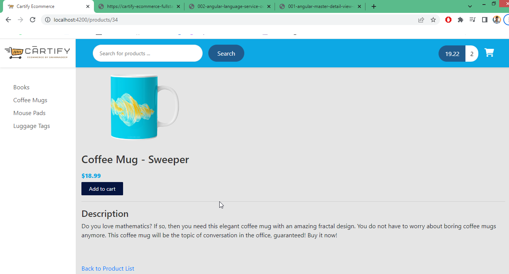
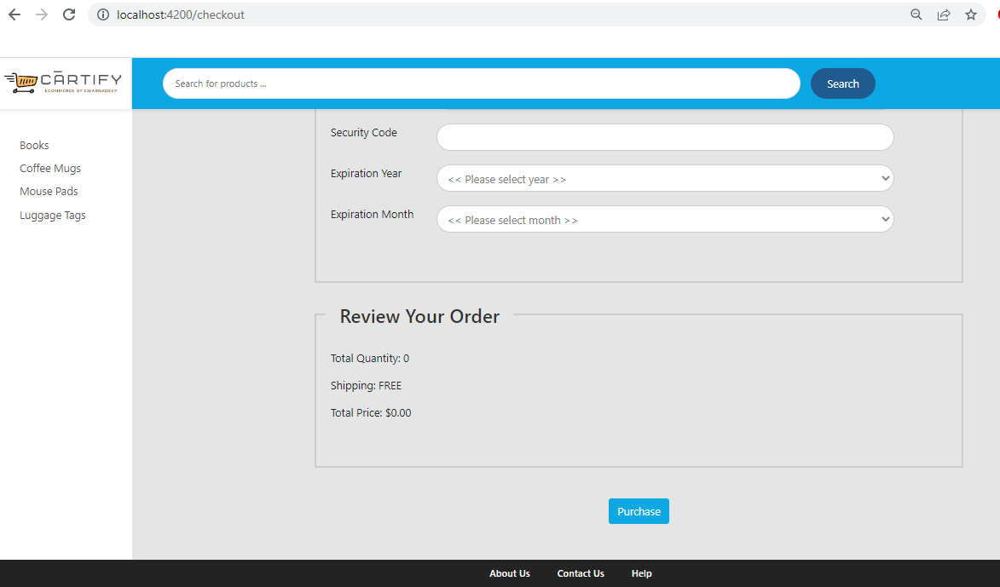

# Cartify Ecommerce Project

Cartify is an ecommerce fullstack application with Login and Credit card payment features, built with Angular as frontend & Spring boot as backend.

**[Live Link](https://cartify-sg.vercel.app)** 

**[Backend url - Deployed on Azure](https://cartify-backend.azurewebsites.net/api)** 

       


### Snapshots

1. Homepage items according to category
   

2. Cart Items with Increment, Decrement, Remove feature
   

3. Pagination 
   

4. Item Details 
   

5. Checkout
   
   

### Docker commands
```sh
# Build
docker build -t swarnadeepghosh/cartify-ecommerce:0.0.1-RELEASE .
 
# Run in local
docker run -d -p 8081:8080 --name=cartify-ecommerce swarnadeepghosh/cartify-ecommerce:0.0.1-RELEASE

# push to dockerhub
docker push swarnadeepghosh/cartify-ecommerce:0.0.1-RELEASE
```

## License

[](https://github.com/Ileriayo/markdown-badges/blob/master/LICENSE)
